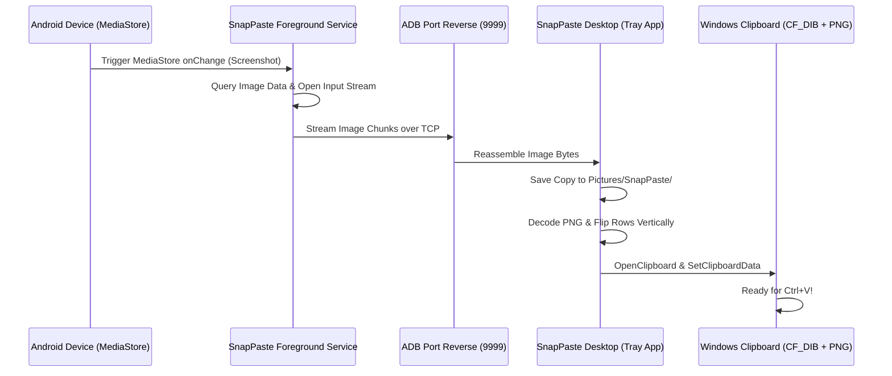

# SnapPaste ⚡

SnapPaste is a lightweight, zero-latency utility that automatically streams screenshots taken on your Android device directly to your Windows PC clipboard and saves them locally, completely bypassing cloud uploads, manual transfers, or intermediate sharing steps.

As soon as you capture a screenshot on your phone, it is beamed over ADB/USB and is instantly ready to paste on your PC using **`Ctrl + V`**.

---

## Key Features

- **Instant Android Observer:** Utilizes a lightweight Android `ContentObserver` on the phone's `MediaStore` database to detect new screenshots in milliseconds.
- **Dual-Format Windows Clipboard:** Registers and copies raw image bytes in both standard **`CF_DIB`** (ensuring compatibility with GDI apps and the **Win + V** Clipboard History panel) and custom **`"PNG"`** format (preserving transparency in supporting apps like Discord and Slack).
- **Silent Background execution:** Compiles under the Windows GUI subsystem to run as a silent background tray service—**no command prompt windows flash or remain open**.
- **Auto-Start on Boot:**
  - **PC:** Integrates directly with Windows Startup registry (`HKCU\...\Run`) to launch silently at login.
  - **Phone:** Registers a BroadcastReceiver listening for boot completion to spin up the observer foreground service on device startup.
- **Auto-Backup Directory:** Automatically saves a physical backup copy of every transferred image to your PC's standard `Pictures/SnapPaste/` folder.
- **Pausing/Toggling:** Left-click the system tray icon at any time to toggle the service **On/Off (Paused)**.

---

## System Architecture



- **Android:** A Foreground Service (configured with type `dataSync` for Android 14+ compatibility) runs in the background, listening to database events on the image table.
- **Desktop:** A native Rust utility running a standard Win32 Message Pump in the background. It listens for incoming packets on localhost port `9999` and runs a dedicated, thread-safe message-only window thread (`HWND_MESSAGE`) to own clipboard operations.
- **Port Reversing:** Employs `adb reverse tcp:9999 tcp:9999` so that the Android client can connect directly to the PC's TCP listener on localhost, preventing port binding conflicts on the PC side.

---

## Installation & Setup

### Prerequisites

1. **PC:** Make sure you have the [Rust Toolchain](https://rustup.rs/) installed, and `adb` is added to your system's global `PATH`.
2. **Phone:** Enable **Developer Options** and **USB Debugging** on your Android device.

---

### Step 1: Install & Start the Android Service

1. Connect your phone to your PC via USB.
2. In your terminal, navigate to the `android` folder and run:
   ```bash
   ./gradlew installDebug
   ```
3. Grant storage permissions dynamically to the headless service using ADB:
   ```bash
   adb shell pm grant com.snappaste.app android.permission.READ_MEDIA_IMAGES
   adb shell pm grant com.snappaste.app android.permission.READ_EXTERNAL_STORAGE
   adb shell pm grant com.snappaste.app android.permission.POST_NOTIFICATIONS
   ```
4. Start the service:
   ```bash
   adb shell am start-foreground-service -n com.snappaste.app/com.snappaste.app.service.SnapPasteService
   ```

*Note: The service is now running in the background on your phone and is configured to start automatically whenever your phone boots up.*

---

### Step 2: Build & Launch the PC Desktop App

1. In your terminal, navigate to the `desktop` folder and compile the release binary:
   ```bash
   cargo build --release
   ```
2. Navigate to `desktop/target/release` in Windows Explorer and double-click **`snappaste-desktop.exe`**.
3. Right-click the blue SnapPaste icon in your **System Tray** (near the clock) and select **Start with Windows** to enable automatic launching.

---

## Usage

1. Connect your phone via USB.
2. Take a screenshot on your phone.
3. Press **`Ctrl + V`** anywhere on your PC (or press **`Win + V`** to select it from your Clipboard History list).

To temporarily pause the service, click **Enabled** in the right-click menu or simply left-click the System Tray icon.

---

## License

This project is open-source under the [MIT License](LICENSE).
